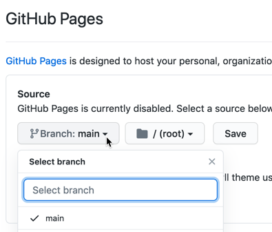

# cth-storymaps
Leaflet Storymaps customized for CT Humanities with multi-map setup using uploaded CSV data files, not a linked Google Sheet. Based on [Leaflet Storymaps with Google Sheets](https://github.com/HandsOnDataViz/leaflet-storymaps-with-google-sheets) by Jack Dougherty and Ilya Ilyankou, authors of *Hands-On Data Visualization* https://HandsOnDataViz.org/leaflet-storymaps-with-google-sheets.html

## Live link to index page for storymaps
- https://cthumanities.github.io/cth-storymaps/index.html
- or
- https://jackdougherty.github.io/cth-storymaps/index.html

## Organization of CTH Storymaps

... TODO...


## One-time steps to create a linked copy of CTHumanities repository and publish on GitHub Pages 

1. Go to Jack's version of the cth-storymaps GitHub repository at https://github.com/jackdougherty/cth-storymaps
2. In upper-right corner, log into your CTHumanities GitHub account
3. In upper-right corner, click the *Fork* button, to create a *linked* copy in the CTH GitHub account.
4. Your linked copy of the repository will appear in your GitHub account at https://github.com/cthumanities/cth-storymaps
5. You can automatically publish your cth-storymaps content on the web with the free GitHub Pages feature. In upper-right corner, click the *Settings* button, scroll down to *GitHub Pages* section, select *Source > Main*, and press *Save*.

6. Wait about 30-60 seconds, and your cth-storymaps content, plus any updates you make to your GitHub repository, will appear online at: https://cthumanities.github.io/cth-storymaps/index.html

One advantage of creating a *linked* copy from Jack's GitHub repository is that in the future, if you wish to contract him to do more work, he can edit content in his repository and *push* changes to your repository, which you can accept (or reject) with a button.


## To Edit an Existing Storymap

... TODO ...

## To Create a New Storymap
- choose a short and unique keyword for each new storymap (such as *architecture* or *ridgefield-business*)
- in `media` folder, create subfolder with keyword name (such as `architecture`), and upload images (JPG or PNG) or other media
- design your storymap based on your copy of the Leaflet Storymaps with Google Sheets template https://docs.google.com/spreadsheets/d/1AO6XHL_0JafWZF4KEejkdDNqfuZWUk3SlNlQ6MjlRFM/edit#gid=0
- in the spreadsheet template, make sure that pathnames to media files follow the format above, such as `media/architecture/image.jpg`
- in Google Sheets, File > Download as CSV, *carefully* rename to keyword-options.csv and keyword-chapters.csv *with no internal spaces*, then upload to `csv` folder
- in project folder, create duplicate of existing storymap file (such as `architecture.html`), rename to keyword.html, and modify pathnames to the CSV files in this section of the code:
  ```
  <!-- edit pathnames to map data for options and chapters -->
  <script>
    $(window).on('load', function() {
      initStorymap(
        'csv/architecture-options.csv',
        'csv/architecture-chapters.csv'
      );
    })
  </script>
  ```
- in the `index.html` file, add new link to your keyword.html storymap

#### Geocode your address data with Google Sheets add-on
To geocode (find latitude and longitude coordinates), we recommend installing the free [Geocoding by SmartMonkey add-on for Google Sheets](https://gsuite.google.com/marketplace/app/geocoding_by_smartmonkey/1033231575312). Insert your addresses in place of the samples in the Geocoding Details tab, then use Add-Ons > Geocoding > Geocode Details menu. Learn more in *Hands-On Data Visualization* https://handsondataviz.org/geocode.html


